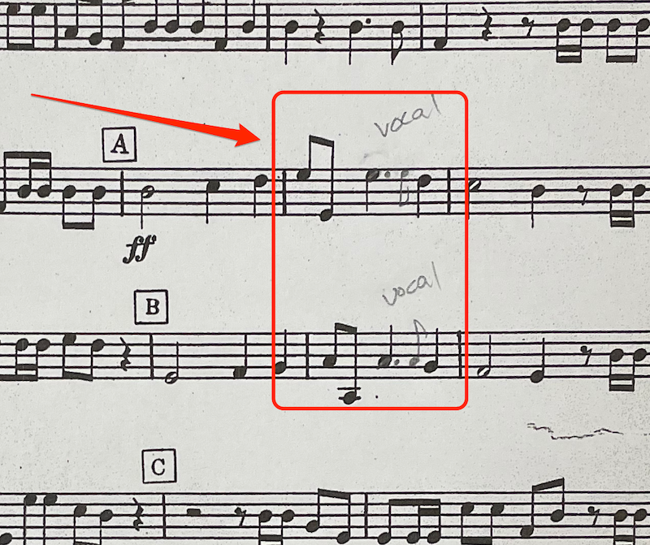

# December 14th, 2021

## Concert Notes

### Hallelujah Chorus

- To better algin with the vocal version of the tune, we're altering the written rythym in several places. 2 measures after A and 2 measures after B is written 8th, 8th, half note quarter note. This will be played **instead as 8th, 8th, dotted quarter note, 8th note quarter note**. (Screenshot below) This should be applied whenever you're playing this melody rythym throughout the piece.
- 3 measures before box G, add breath marks after the dotted quarter notes to bring a clear separation to this line.

### Christmas Legends

- Measures 24 and 25 should be played as bell tones, not as a slurred line.
- 2nd and 3rd clarinets really play full (perhaps a dynamic marking louder) at box 50
- Disregard the "Solo" marked at box 94. All clarinets should play this line.

### Christmas Typtich

**1st movement**

Read straight through

**2nd Movement**

- Will be conducted in 6 unless otherwised marked. (i.e. circle 3 in 3/4)
- Pay close attention 7 measures from the end where there is a measure of 3/8.

**3rd Movement**

- 10 measures after circle 5, play piano, then crescendo 3 measures later.

### Deck The Halls with Boughs of Holly

- Practice the Soli's at Box 17 and 3 after 49.
- Similarly practice the 16th note runs from box 69 through 89. Ideally we'd get that as cleanly as we can with staccato articulation throughout.

### Go Tell it on the Mountain

- Play all dynamics as marked.
- Note the subito piano and crescendo at measure 70

### Charlie Brown Christmas

- Box 37 will be conducted in 1. There will be no cut-off after the fermada, so be ready to jump straight into the 8th notes
- Watch for the Rallantando after box 82

### A Family Christmas

- Will be conducted in 4/4 time throughout. My 3rd clarinet part had cut-time marked as several locations.
- Be careful of the Key changes at box 51 and 82
- Last 6 measures will ritardando and will fade away (i.e. no hard cut-off, but softly fading the music to nothing)

### Christmas Variants

- 3 Measures before box 57, the band passes an 8th note run from section to section. Bring out the 8ths when you have them, and back off when you don't
- Stagger breathe the ostinati from 57 through 80; and at 223 through 233
- Watch the 8th note runs at boxes 57 - 77, 133, 151, 3 before 161, and after 185.

### New Age Christmas

- Stay together and keep the staccatos clean at box 51 through 54.
- Cut measures 85 through 88.

### A Christmas Portrait

- 2 before 18 will be played along with a vocalist. Don't overpower the vocals

### The Christmas Waltz

- Box 9 will be conducted in 1
- Ignore most of the ritardandos except for at box 85 which slow down to be conducted in 3/4

### Midnight Sleighride

- Carefully read your rythym at measures 26 and 27, each section has a slightly different rythym here.
- Add a crescendo to the half note at measure 41.

## Lineup

|               |                               |
| ------------- | ----------------------------- |
| 1st Part      |                               |
|               | Kaz Chan                      |
|               | Daisy Chew                    |
|               | Ed Kingsley                   |
| 2nd Part      |                               |
|               | Sable Stewart                 |
|               | Shelby Ervin                  |
|               | Jennifer Sherbak              |
| 3rd Part      |                               |
|               | James Alexander               |
|               | Margaret Johnston (Tentative) |
|               | Jennifer Tetzlaff             |
|               | Dennis Schafer                |
|               | John Wood                     |
| Bass Clarinet |                               |
|               | Flora Garrison                |
