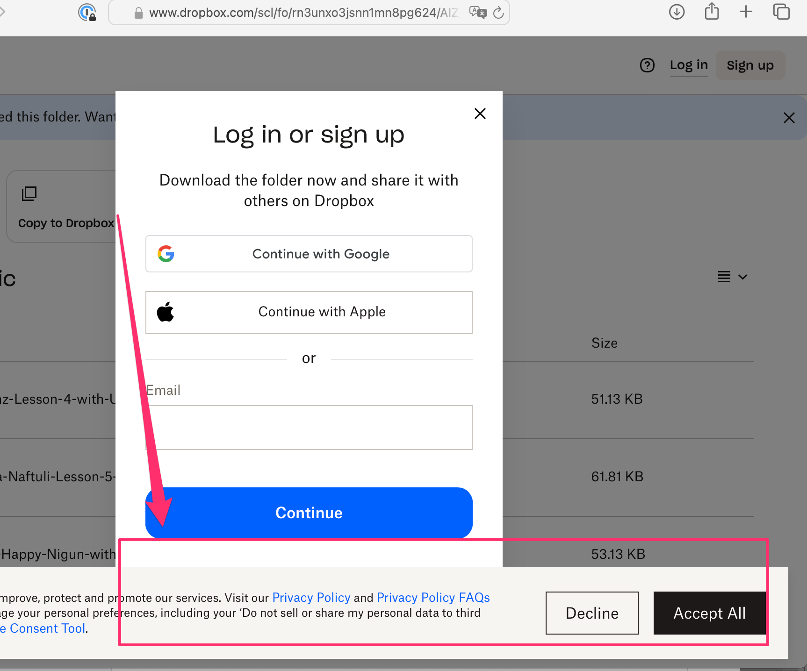
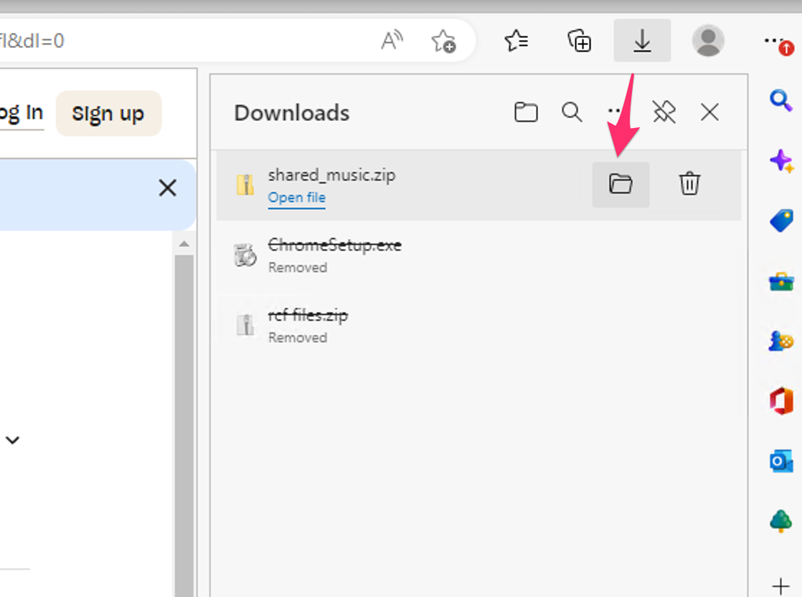
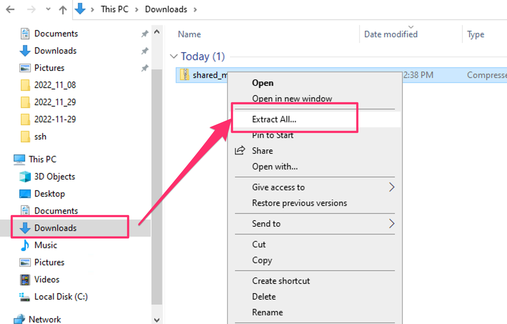
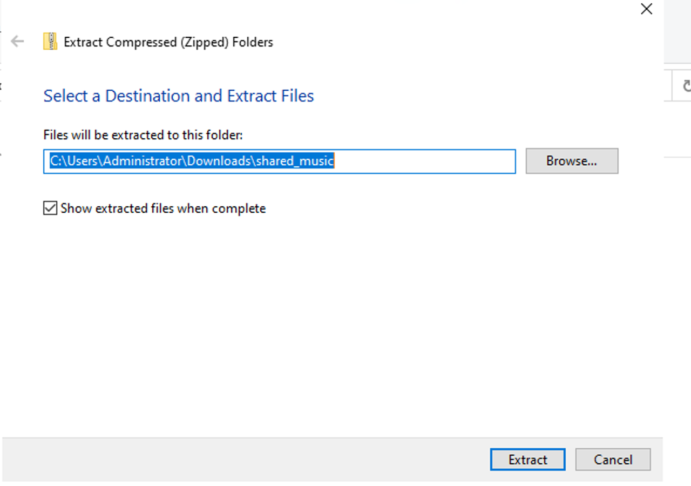
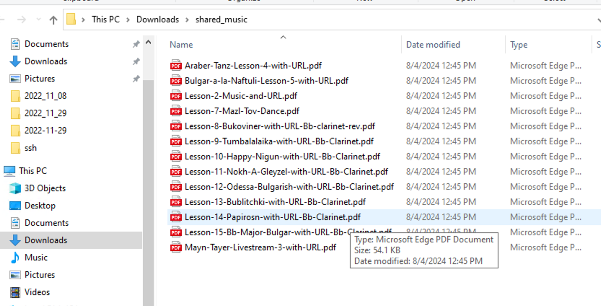

# Downloading Music from Dropbox

1. From the received link, click on the "Download" button on the top of the screen to download all music in the folder.
2. You don't need to create an account or login. You may need to scroll down to see the link mentioned in step 3.
3. Click on the "Or continue with Download only" option below the login prompt (see image below)

## Troubleshooting

Depending on your computer's screen size, the cookies warning may be blocking this link. If so, click the "Decline" button to dismiss the cookie warning so that you can see the download button.

### Microsoft Edge / Chrome on Windows

If you used Microsoft Edge or Chrome to download the Dropbox folder, a new .zip file will have been downloaded to your "Downloads" folder. You can use the "Show in Folder" button to open Windows Explorer directly to your Downloads folder:

#### Extracting From .ZIP

You'll need to extract the contents of the .zip file to see the PDF files. Right-click on the .zip file and select "Extract All" to extract the contents of the .zip file.

A new window will open asking where you want your extract music to be placed. You can leave the default selection. This will make a new folder with the same name as the .zip file, and all of the PDFs will be in that folder. Click the **"Extract"** button to extract the files.

You can now open the PDFs in your favorite PDF reader. Most browsers have a built-in PDF reader, but you can also use Adobe Acrobat Reader or another PDF reader of your choice.

### Chrome on a Mac

If you used Chrome to download the files, a new folder will be created in your "Downloads" folder. The name of the new folder will depend on how the music has been shared. In the screenshot below, the folder is named "shared_music". Open that folder to see all of the PDFs you can open and download. Files will be extracted automatically.

