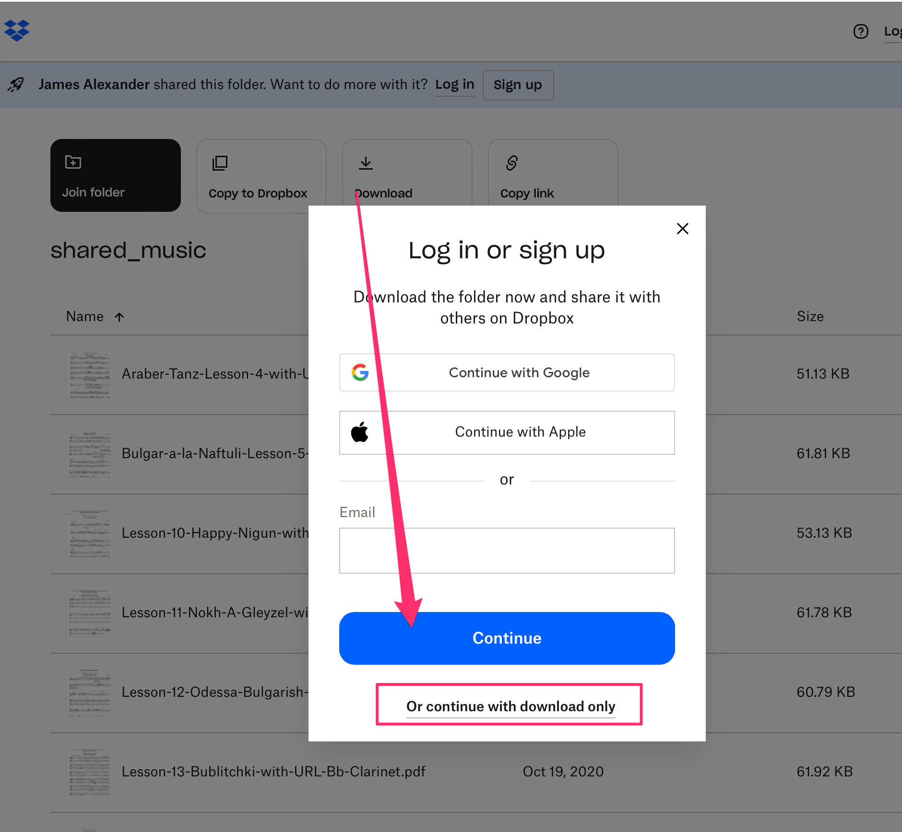
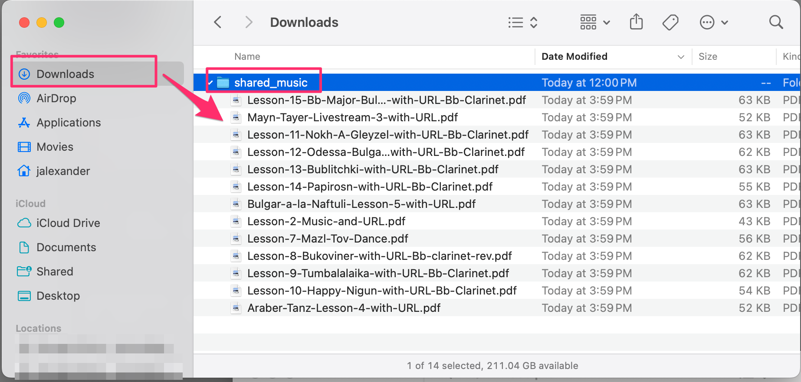

# Downloading Music from Dropbox

1. From the received link, click on the "Download" button on the top of the screen to download all music in the folder.
2. Ignore the "Sign in" prompt.
3. Click on the "Or continue with Download only" option below the login prompt (see image below)

- A new folder will be created in your "Downloads" folder. The name of the new folder will depend on how the music has been shared. In the screenshot below, the folder is named "shared_music". Open that folder to see all of the PDFs you can open and download.

